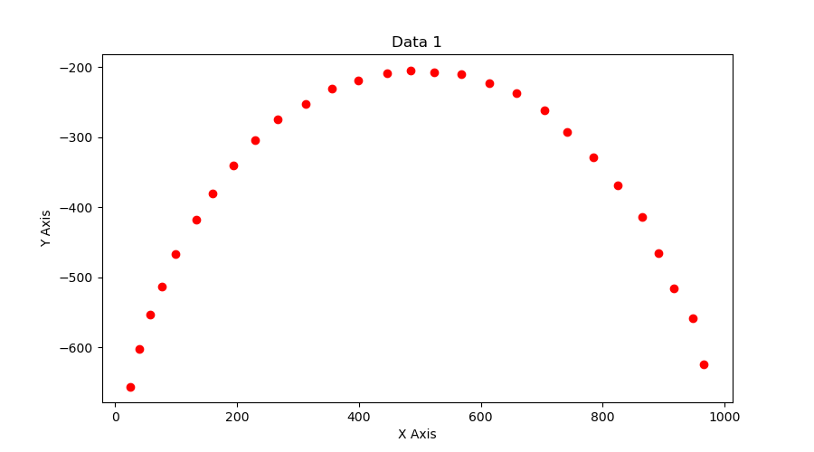
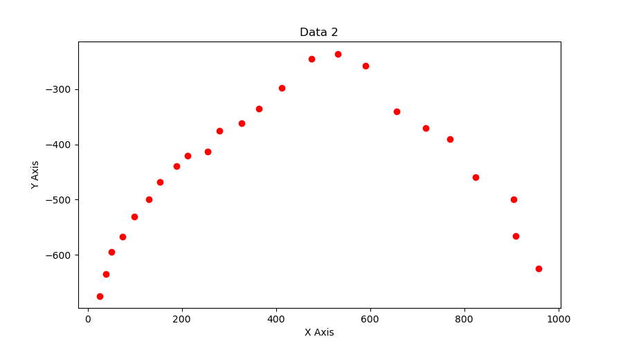
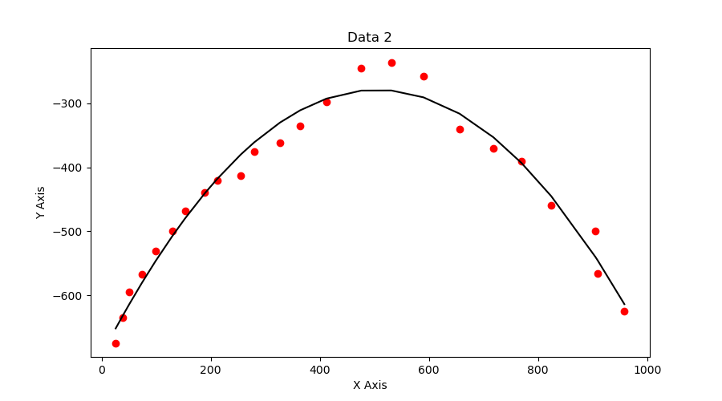
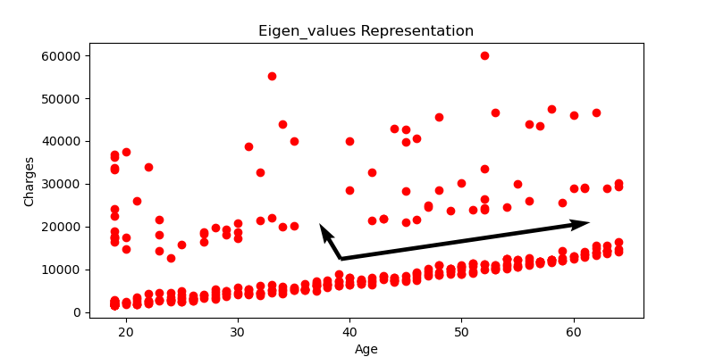
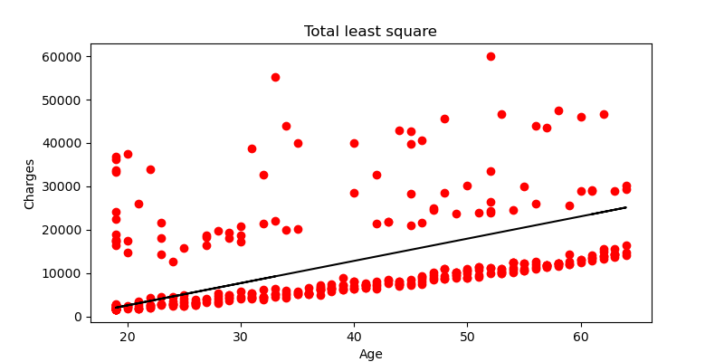

# Curve_Fitting
## Directory tree
- __Curve\-Fitting__
   - __code__
     - [SVD.py](code/SVD.py)
     - [curve\_fitting.py](code/curve_fitting.py)
     - [generate\_csv\_file.py](code/generate_csv_file.py)
     - [standard\_least\_squares.py](code/standard_least_squares.py)
   - __data\_files__
     - [data1.csv](data_files/data1.csv)
     - [data2.csv](data_files/data2.csv)
     - [datap1.csv](data_files/datap1.csv)
     - [linear\_regression\_dataset.csv](data_files/linear_regression_dataset.csv)
     - [video1.mp4](data_files/video1.mp4)
     - [video2.mp4](data_files/video2.mp4)
   - __plots__
     - [LLS.png](plots/LLS.png)
     - [RANSAC.png](plots/RANSAC.png)
     - [TLS.png](plots/TLS.png)
     - [eigen\_representation.png](plots/eigen_representation.png)
     - [points.png](plots/points.png)
     - [points2.png](plots/points2.png)
     - [video1.png](plots/video1.png)
     - [video2.png](plots/video2.png)
   - [questionnaire.pdf](homework1.pdf)
   - [report.pdf](Enpm673_Homework1_report.pdf)
     

## Problem 1
A ball is thrown against a white background and a camera sensor is used to track its
trajectory. We have a near perfect sensor tracking the ball in [video1](./data_files/video1.mp4) and the second sensor is faulty and tracks the ball as shown in [video2](./data_files/video2.mp4). Clearly, there is no noise added to the first video whereas there is significant noise in the second video. Assuming that the trajectory of the ball follows the equation of a parabola:

1. Use Standard Least Squares to fit curves to the given videos in each case. You
have to plot the data and your best fit curve for each case. Submit your code
along with the instructions to run it.

## Execution
**1. To generate .csv file from video**
``` bash
python3 generate_csv_file.py --FilePath='./data_files/video1.mp4' --CSVFilePath='./<Path>/<File_Name>.csv' 
```
- FilePath -  Video file path. *Default :- ' ./data_files/video1.mp4 '*
- CSVFilePath - File path to save csv file. *Default :- ' ./data_files/data1.csv '*

**2. To fit the curves**
- Using Standard Least Squares to fit from generated .csv file.
- Specify your .csv file paths in python file for both videos and run the following command.
``` bash
python3 standard_least_squares.py
```
### Results
### For video1:
#### Points
  

#### Standard Least Squares Method
 

### For video2:
#### Points
  

#### Standard Least Squares Method
 

## Problem 2
In the above problem, we used the least squares method to fit a curve. However, if the
data is scattered, this might not be the best choice for curve fitting. In this problem, you are given data for health insurance costs based on the person’s age. There are other fields as well, but you have to fit a line only for age and insurance cost data. The data is given in .csv file format [here](./data_files/linear_regression_dataset.csv)

1. Compute the covariance matrix (from scratch) and find its eigenvalues and eigenvectors. Plot the eigenvectors on the same graph as the data.
2. Fit a line to the data using linear least square method, total least square method
and RANSAC.

## Execution  
- Run the following command-    
```bash
python3 curve_fitting.py
```

### Results
#### Eigen Value Representation  
  

#### Linear least square method  
  

#### Total least square method  
  

#### RANSAC  
  

## Problem 3
Write python code to compute the SVD for given matrix- [refer this](./homework1.pdf)  

## Execution  
- Run the following command-    
```bash
python3 SVD.py
```